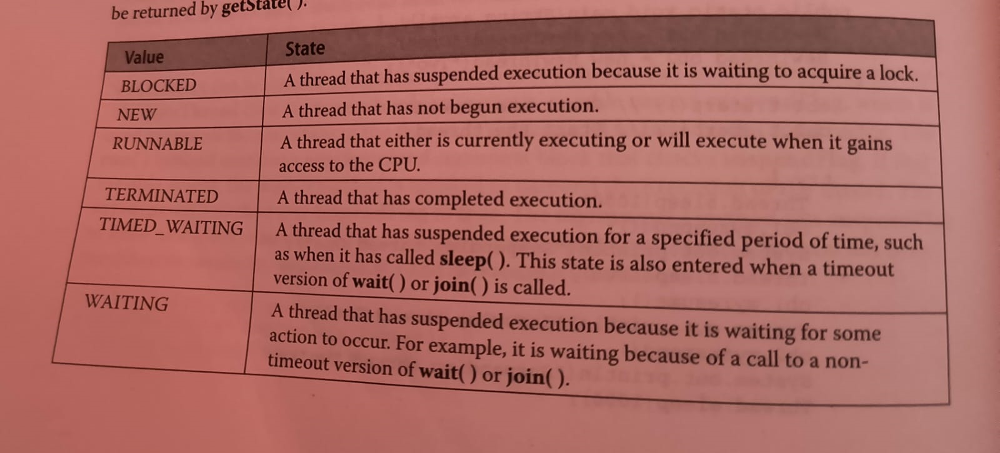

- Interview Questions...
	- Oops concepts. done....
	  logseq.order-list-type:: number
	- What is class and object. done....
	  logseq.order-list-type:: number
	- What are stored in heap and stack memory. done....
	  logseq.order-list-type:: number
	- 1D and 2D Array cloning . done....
	  logseq.order-list-type:: number
	- Abstract Array. done....
	  logseq.order-list-type:: number
	- Custom Exception creating using Exception class and Runtime Exception class. done.....
	  logseq.order-list-type:: number
	- constructor and it types. done.....
	  logseq.order-list-type:: number
	- Importance of imports in java. done.....
	  logseq.order-list-type:: number
	- When to use interface and abstract class.
	  logseq.order-list-type:: number
	- methods which cannot be inherrited.
	  logseq.order-list-type:: number
	- Diff between runtime and compile time polymorphism. done.....
	  logseq.order-list-type:: number
	- Thread class and runnable interface.
	  logseq.order-list-type:: number
	- Features of Priority Queue and Tree set .
	  logseq.order-list-type:: number
	- Cursor Class
	  logseq.order-list-type:: number
	- What is shadowing
	  logseq.order-list-type:: number
	-
	-
	-
	- class Demo{
	  logseq.order-list-type:: number
	- public int A(){
	  logseq.order-list-type:: number
	- return 0;
	  logseq.order-list-type:: number
	- }
	  logseq.order-list-type:: number
	- }
	  logseq.order-list-type:: number
	- class Overriding extends Demo{
	  logseq.order-list-type:: number
	- private int A(){
	  logseq.order-list-type:: number
	- return 0;
	  logseq.order-list-type:: number
	- }
	  logseq.order-list-type:: number
	- }
	  logseq.order-list-type:: number
	- public class Main{
	  logseq.order-list-type:: number
	- public static void main(String[] args) {
	  logseq.order-list-type:: number
	- Demo d = new Demo();
	  logseq.order-list-type:: number
	- d.A();
	  logseq.order-list-type:: number
	- }
	  logseq.order-list-type:: number
	- }
	  logseq.order-list-type:: number
	-
	-
	-
	- class Demo{
	  logseq.order-list-type:: number
		- Demo(){
		  logseq.order-list-type:: number
			- System.out.println("Hi");
			  logseq.order-list-type:: number
		- }
		  logseq.order-list-type:: number
		- int A(){
		  logseq.order-list-type:: number
			- return 0;
			  logseq.order-list-type:: number
		- }
		  logseq.order-list-type:: number
		- }
		  logseq.order-list-type:: number
	- class Overriding extends Demo{
	  logseq.order-list-type:: number
		- Overriding(){
		  logseq.order-list-type:: number
			- System.out.println("Haripriya");
			  logseq.order-list-type:: number
		- }
		  logseq.order-list-type:: number
		- public int A(){
		  logseq.order-list-type:: number
			- return 0;
			  logseq.order-list-type:: number
		- }
		  logseq.order-list-type:: number
	- }
	  logseq.order-list-type:: number
	- public class Main{
	  logseq.order-list-type:: number
		- public static void main(String[] args) {
		  logseq.order-list-type:: number
			- Demo d = new Demo();
			  logseq.order-list-type:: number
			- d.A();
			  logseq.order-list-type:: number
		- }
		  logseq.order-list-type:: number
	- }
	  logseq.order-list-type:: number
	-
	-
	-
	-
	- 
	  logseq.order-list-type:: number
	- 
	  logseq.order-list-type:: number
	- logseq.order-list-type:: number